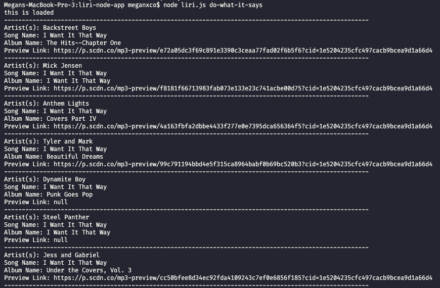

# liri-node-app

LIRI stands for Language Interpretation and Recognition Interface. LIRI is a command line node app that takes in parameters and gives you back data using axios packages for Bands in Town and OMDB, the node spotify API, moment.js, and DotEnv.

LIRI is made on HTML, CSS, and JavaScript files as well as json files for axios calls.

### Function to search artist events on BandsinTown API

### Function to search song on Spotify API

### Function to search movie information on OMDB API

### Function that uses fs package to call one of LIRI's commands

